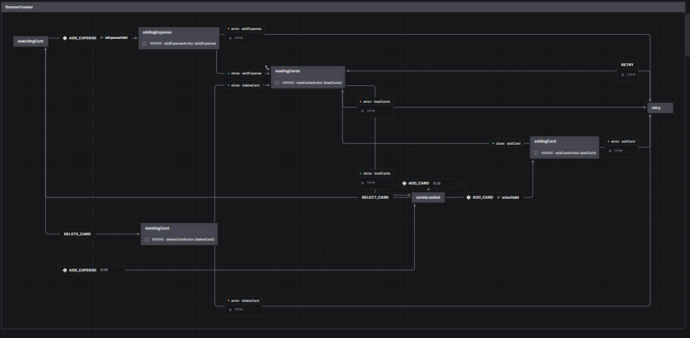

# Finance Tracker

## About my mini-project :sparkles:

I tried to recreate a Finance Tracker where users can add, delete, and update cards for expenses.
Furthermore, they can pick the color of the card and currency, and they can see their history of expenses.
On the Home page, all the users' cards are displayed, and on the Manage page, they can perform the operations I mentioned above.

## Lab 5 description :astonished:

For my lab 5, I used state management with XState. XState is a library that implements
finite state machines and statecharts, providing a way to model complex states and transitions
in applications. It allows you to define clear states, events, and actions, ensuring predictable
behavior, improving maintainability, and making state management more structured.
XState also supports hierarchical states, parallel states, and state history,
making it highly flexible for managing both simple and complex state logic.

### Here's my machine schema

My [macine](./src/machines/financeTracker.js) has 4 states: loadingCards, cardsLoaded, selectingCard, and retry. Each state has actions that transition it to the next state, and some of them have associated actions. For example, cardsLoaded has the actions ADD_CARD and SELECT_CARD.

In the context of React states, this function performs a context, some of which I use in my application, like [cardsHolder](./src/pages/home/Home.jsx#L9-L11) and [errorMessage](./src/components/loadingOrErrorWrapper/LoadingOrErrorWrapper.jsx#L10-L12), and another for transporting to my [invoked actors](./src/machines/financeTracker.js#L10-L56), because fromPromise takes input. I have also added [guards](./src/machines/financeTracker.js#L57-L60) to validate external data.

In my React application, I created a [context](./src/context/financeTrackerContext.jsx) where I instantiate an actor containing a state and an actorRef. The [actorRef](./src/components/expenseCard/ExpenseCard.jsx#L20-L22) acts as an action sender.

## Lab 6 description :blush:

Best Practices I used for my project

- Keeping all files related to a component in a single folder.

  [Here's](./src/) my file structer

- Maintaining a structured import order.

  [Here's](./src/App.jsx#L1-L16) an example

- Implementing lazy loading.

  Not all of my components have lazy loading because I thought some components are rendered as soon as the page loads. [Here's](./src/pages/manage/Manage.jsx#L3-L9) an example

- Using state management.

  For my project, I used XState.

- Creating reusable components

  - FormInput;
  - FormSelect;
  - FormTextArea;
  - Card;
  - List;
  - UnexpectedError;
  - loadingOrErrorWrapper.

- Using Context to avoid prop drilling.

  Form provider and provider for state machine

- Implementing React Error Boundaries.
  - Used in react-router ([errorElement](./src/App.jsx#L23))
